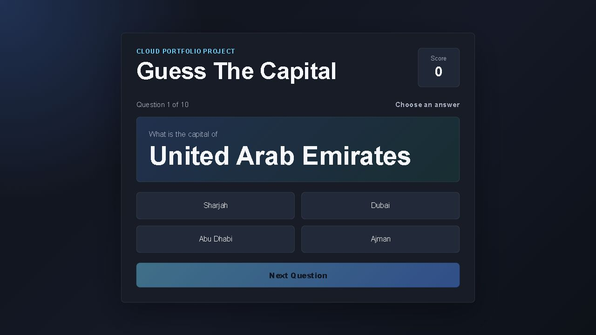

# Guess The Capital Game

Guess The Capital Game is a small web-based quiz game where users try to guess the capital cities of different countries.

I worked on this project while learning cloud computing and deployment basics. The main goal was not only to build a simple game, but also to understand how a web application can be hosted and deployed online.



## Live Demo

[Play the live game](https://markebinaizer.github.io/guess-the-capital-game/)

## Features

- Random capital city questions
- 30+ countries included
- Multiple choice answers
- Score tracking
- Automatic next question after answering
- Manual Next Question button
- Final score screen after 10 questions
- Modern dark theme UI
- Mobile responsive design
- Works offline in the browser

## Tech Used

- HTML
- CSS
- JavaScript
- IBM Cloud Code Engine

## Deployment

This application was deployed using IBM Cloud Code Engine through a guided cloud lab environment.

The project can also be hosted as a static website using GitHub Pages, AWS S3, Netlify, or similar static hosting services because it only uses HTML, CSS, and JavaScript.

## Project Files

```text
guess-the-capital-game/
├── index.html
├── style.css
├── script.js
├── README.md
└── guess-capital-game-screenshot.png
```

## What I Learned

Through this project, I got introduced to:

- Cloud deployment workflows
- Hosting applications online
- Working with cloud environments
- Basic application deployment concepts
- Organizing frontend files for deployment
- Building a simple interactive JavaScript project

This project helped me understand how cloud platforms can be used to run web applications in real-world environments.

## Future Improvements

Some things I would like to improve in the future:

- Add difficulty levels
- Add a timer mode
- Add more countries
- Save high scores in browser storage
- Improve accessibility and keyboard support
- Host the project on AWS S3 as another cloud deployment
